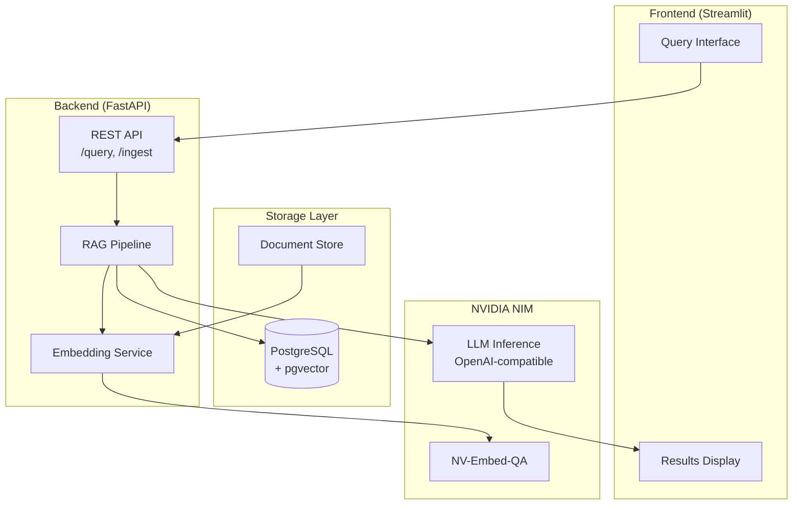
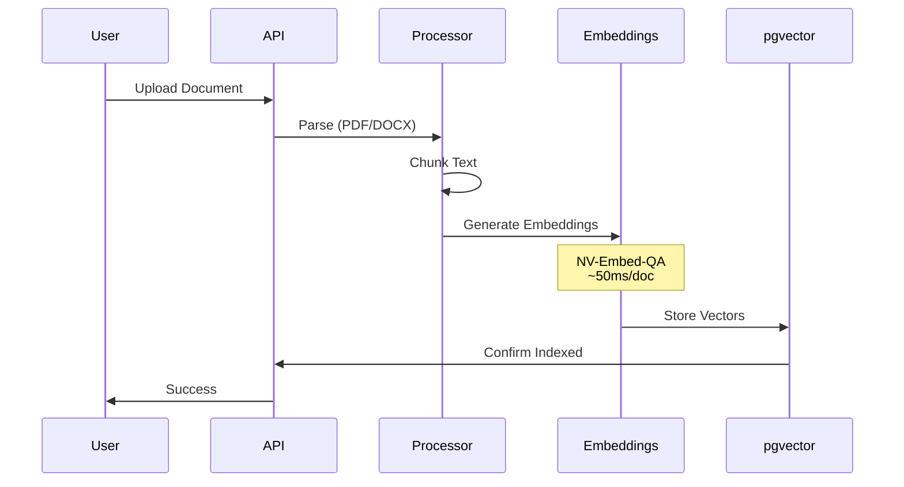
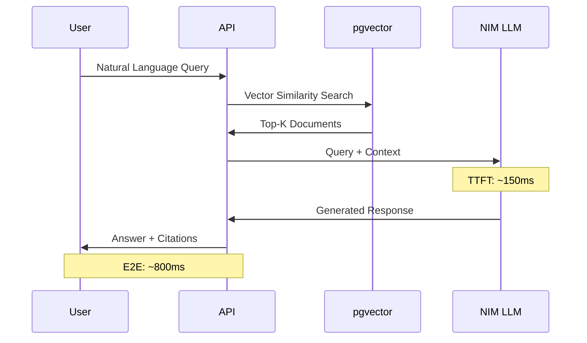
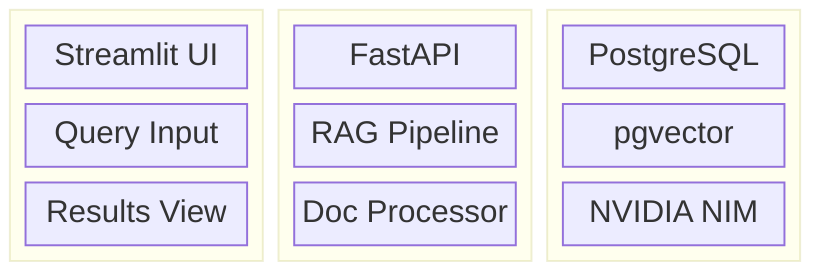

# NVIDIA NIM RAG Demo Architecture

## System Overview

## Document Ingestion Flow

## Query Flow

## Component Stack

## Performance Metrics

| Metric | Value | Description |
|--------|-------|-------------|
| TTFT | ~150ms | Time to first token |
| E2E Latency | ~800ms | Full query response |
| Embedding | ~50ms | Per document |
| Throughput | ~20 req/sec | Concurrent handling |

---
*Built by [QbitLoop](https://github.com/QbitLoop)*
